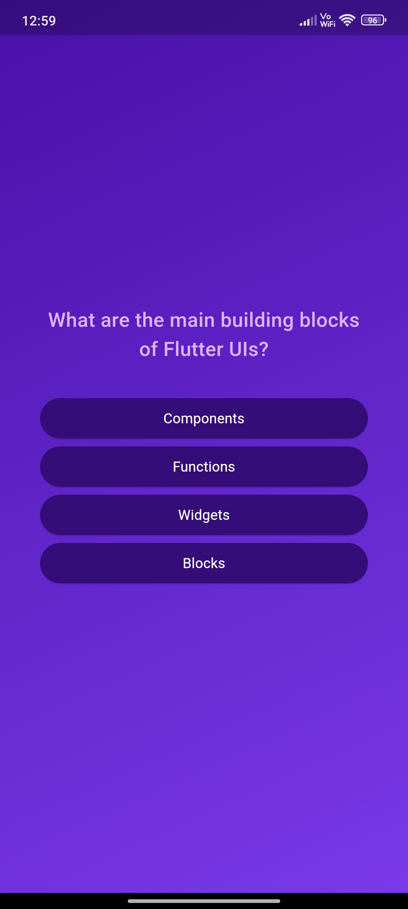

# Quiz APP

Welcome to Quiz APP! This Flutter-based application allows users to test their knowledge on various topics with a series of multiple-choice questions. The app is designed to be user-friendly, engaging, and educational.

## Features

- **Interactive Quiz Interface**: Seamlessly navigate through questions and choose your answers.
- **Results Summary**: Review your performance with a detailed summary of your answers, including correct and incorrect responses.
- **Customizable Questions**: Easily add or modify questions to suit different topics and difficulty levels.
- **Responsive Design**: Enjoy a smooth and consistent user experience on both Android and iOS devices.

## Screenshots




## Installation

To run Quiz APP on your local machine, follow these steps:

1. **Clone the repository, navigate to the project directory, and install dependencies:**
   ```bash
   git clone https://github.com/yourusername/quiz-app.git
   cd quiz-app
   flutter pub get
   flutter run

## Usage

1. **Start the Quiz:** Press the "Start Quiz" button on the home screen.
2. **Answer Questions:** Select your answer for each question and navigate to the next one.
3. **View Results:** After answering all questions, view your results and see which answers were correct or incorrect.
4. **Restart Quiz:** Use the "Restart Quiz" button to take the quiz again.

## Customization

To add or modify questions, update the `questions.dart` file in the `lib/data` directory. Each question should follow the structure provided in the file.

**Example:**

```dart
final questions = [
  Question(
    text: 'What is the capital of France?',
    answers: [
      'Paris',
      'London',
      'Berlin',
      'Madrid',
    ],
  ),
  // Add more questions here
];
Contributing
Contributions are welcome! If you have any ideas, suggestions, or bug fixes, please create a pull request or open an issue in the repository.

Fork the repository.
Create your feature branch:
bash
Copy code
git checkout -b feature/your-feature
Commit your changes:
bash
Copy code
git commit -m 'Add your feature'
Push to the branch:
bash
Copy code
git push origin feature/your-feature
Open a pull request.

## License

This project is licensed under the MIT License. See the `LICENSE` file for details.

